# 한동대 AWS Camp Day-3-1 Bigdata 실습

## 목차
1. [EMR을 통해 분석환경 구축하기](#1-emr을-통해-분석환경-구축하기)
2. [데이터셋 준비하기](#2-데이터셋-준비하기)
3. [Zeppelin을 이용하여 데이터 전처리](#3-zeppelin을-이용하여-데이터-전처리)
4. [AWS Glue를 이용하여 데이터 카탈로그 생성](#4-aws-glue를-이용하여-데이터-카탈로그-생성)
5. [Quicksight로 시각화하기](#5-quicksight로-시각화하기)


## 0.Overview

빅데이터, 말이 어렵지만 데이터의 사이즈가 커져서 어려운 것일뿐, 그저 데이터를 잘 모으고, 잘 저장하고, 잘 분석하고, 보기쉽게 보여주면 그만입니다. 

**즉, 수집 - 저장 - 분석 - 시각화 만 잘하면 됩니다.**

물론 이게 쉽지는 않습니다. 수집 단계에서 부터 데이터 유실과 처리량(Throughput), 스키마 등을 고려해야하고, 양이 많아지게 되면 저장도 골치덩어리 입니다. 분석단계에서도 마찬가지로 큰 양을 분석하려면 기본 RDBMS로는 한계가 있죠. 시각화 툴도 그런 데이터에 사이즈를 고려해서 사용해야 합니다. 

이렇게 고려할게 많지만, 이번 세션의 목표는 빅데이터를 마스터하는 것이 아닙니다. 그냥 맛만 한번 보고 빅데이터라는 단어에 막연한 느낌을 조금이라도 지우면 성공이라고 생각합니다. 

이번 세션에서는 간단하게 

1. EMR이라는 분석환경을 구축하고
2. Notebook에서 바로 분석, ETL도 해보고 
3. Glue를 통해 데이터 카탈로그도 만들고 (+ Athena는 덤)
4. 예쁘게 시각화 

해보려고 합니다. 그럼 시작해 봅시다. 

## 1. EMR을 통해 분석환경 구축하기
시작하기에 앞서서 생성한 EMR 클러스터에 ssh 접속을 위해 EC2키페어를 생성합니다.
  - EC2 콘솔메뉴로 이동 
  - `Key Pairs` 메뉴에 `Create Key Pair` 버튼을 눌러서 키페어를 생성합니다. 키페어 생성 즉시 브라우저에서 .pem 파일 하나가 다운로드 됩니다.

```
키페어 이름 :        handong2019
```

  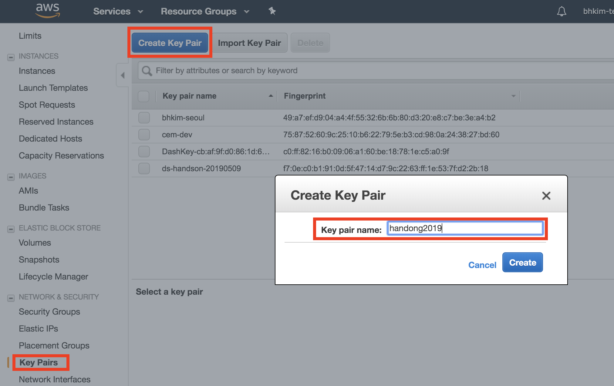
  
  - 윈도우사용자는 Putty등을 이용하여 SSH 접속이 가능합니다.

  https://docs.aws.amazon.com/ko_kr/AWSEC2/latest/UserGuide/putty.html
  
  - MAC사용자는 키파일을 사용하기 위해 아래 명령어로 pem 파일에 권한을 변경합니다.
  
  ```
  chmod 400 handong2019.pem
  ```

  - pem키는 사용 후 꼭 지우시거나 관리해주세요. git에 올리시면 안됩니다!

### 1-1. EMR 시작하기
- 콘솔에서 EMR 서비스로 이동합니다.
- 이전에 EMR 서비스를 사용해보시지 않으셨다면 아래와 같은 화면을 볼 수 있습니다.

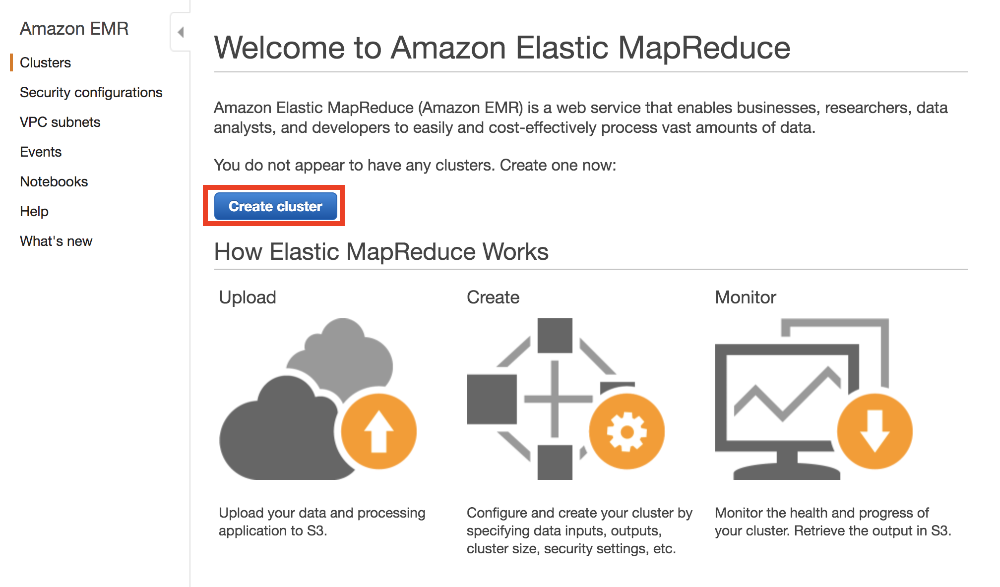

- `Create cluster` 버튼을 눌러 EMR을 생성해보겠습니다.
- EMR 클러스터 생성을 위한 환경설정 메뉴를 확인하실 수 있습니다.
  - 빅데이터 분석을 위해서 어떤 소프트웨어를 사용할 것인지 선택할 수 있습니다.
  - `Use AWS Glue Data Catalog for table metadata` 이란 옵션이 있는데 추후에 Glue를 통해 생성한 데이터 카탈로그의 데이터들에 접근할 수 있습니다.
  - 하드웨어를 선택할 수 있습니다. 선택하시는 인스턴스에 따라 퍼포먼스와 비용에 영향을 줍니다.
  - 또한 좌측 상단에 보시면 `Go to advanced options` 이란 메뉴가 있어서 원하시는 환경을 직접 선택하여 구성하실 수 있습니다.
  - `Go to advanced options`을 선택합니다.

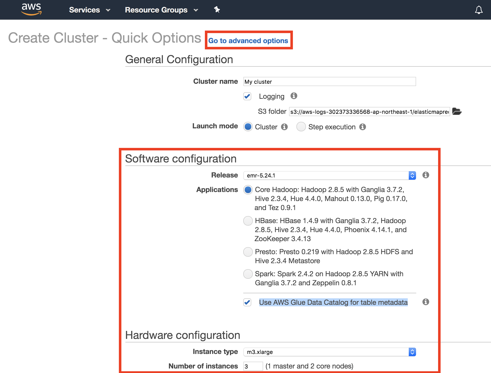

### 1-2. EMR 구성하기
- 소프트웨어 구성을 위한 화면입니다. 이전에 보았던 메뉴구성과 달리 원하시는 소프트웨어의 조합을 마음대로 구성하실 수 있습니다.
- Zeppelin과 Spark 환경을 구성하기 위해 `Hadoop 2.8.5, Zeppelin 0.8.1, Spark 2.4.2`을 선택하였습니다.
- AWS Glue 데이터 카탈로그 설정도 체크하였습니다.

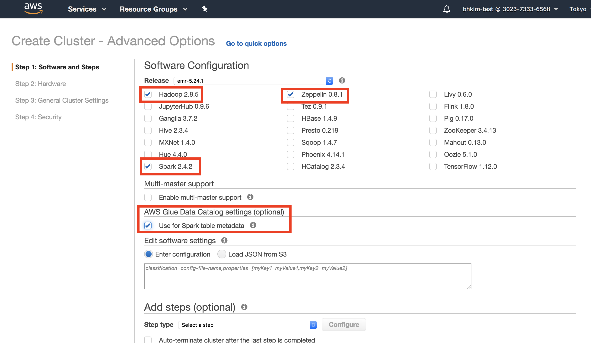

- 하드웨어 구성은 마스터노드 1개는 온디맨드 형태로, 코어노드 2개는 스팟 형태로 띄워보겠습니다.
- 마스터노드에는 Zeppelin을 포함한 여러가지 환경설정들이 저장되어 있어서, 마스터노드가 꺼질경우 전체 분석환경이 비활성화 된다고 생각하시면 됩니다. 반면에 실제 데이터들을 분산하여 처리하는 코어노드나 작업노드는 원하는 작업양 만큼 자유롭게 늘이고 줄이고하는 작업이 가능합니다.
- 코어노드나 작업노드는 비용을 고려하여 스팟 인스턴스 형태로 띄워도 무방합니다. 마스터노드도 스팟인스턴스로 띄워도 되긴 하지만 설명드린 것 처럼 마스터노드에 문제가 생기면 많은 귀찮고 어려운점들이 있으니 온디맨드로 사용하는 것을 권장합니다.

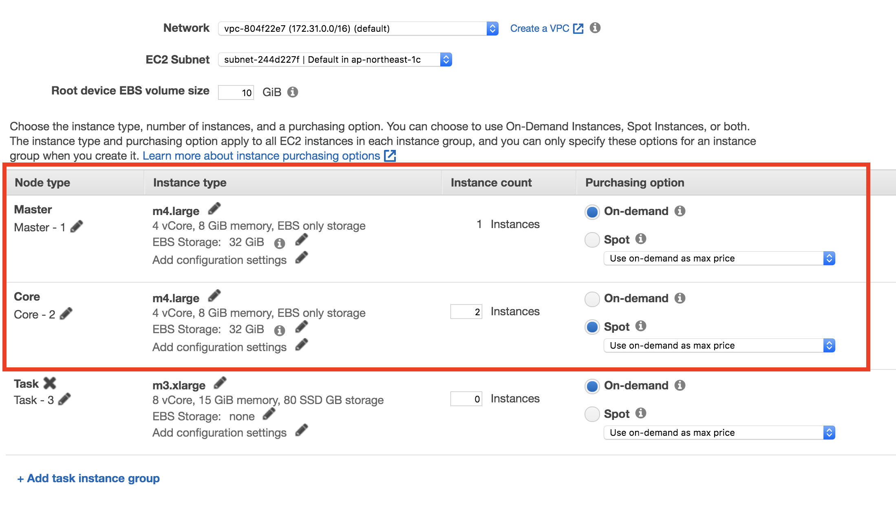

- 클러스터 이름을 입력하고 다음으로 넘어갑니다.

```
클러스터 이름 :        handong2019
```

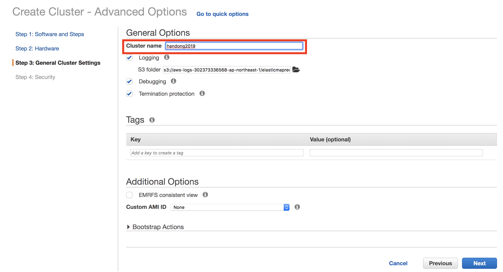

- 마지막 보안을 위한 설정입니다. 최초에 생성한 `키페어를 선택`하고 `Create Cluster` 버튼을 누릅니다.
- 생성완료까지 수분이 소요됩니다. (Status가 `Starting` 에서 `Waiting`으로 바뀌면 성공)

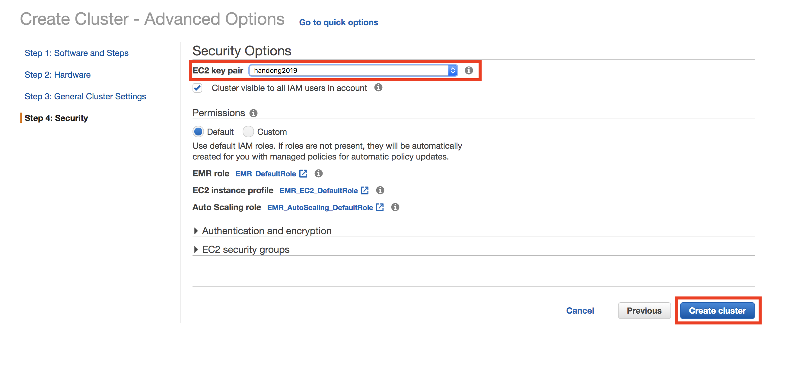

- EMR 클러스터 생성이 완료되면 아래와 같은 화면을 보실 수 있습니다.
- `Master public DNS`는 Zeppelin이나 ssh 접속 시 사용할 수 있습니다.
- `Security groups for Master`에서 보안그룹을 설정하여 접근권한을 제어할 수 있는데, 실습을 위해 현재 IP 기준으로 접근을 허가하도록 하겠습니다.

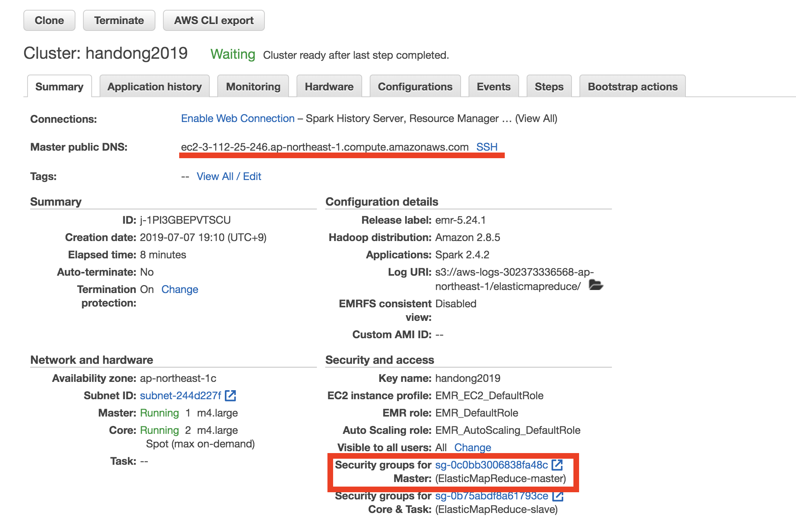

- `ElasticMapReduce-master`을 클릭하면 EC2 콘솔 보안 그룹 메뉴로 이동합니다.
- ElasticMapReduce-master 보안그룹의 인바운드을 편집합니다.


- 8890 포트 (Zeppelin 사용) 22 포트 (ssh 접속)을 사용하는 접근 가능한 소스에 `접속하는 PC의 Public IP`를 추가합니다.
- 접속하는 PC의 Public IP는 http://www.findip.kr 등을 사용하면 쉽게 알 수 있습니다. 

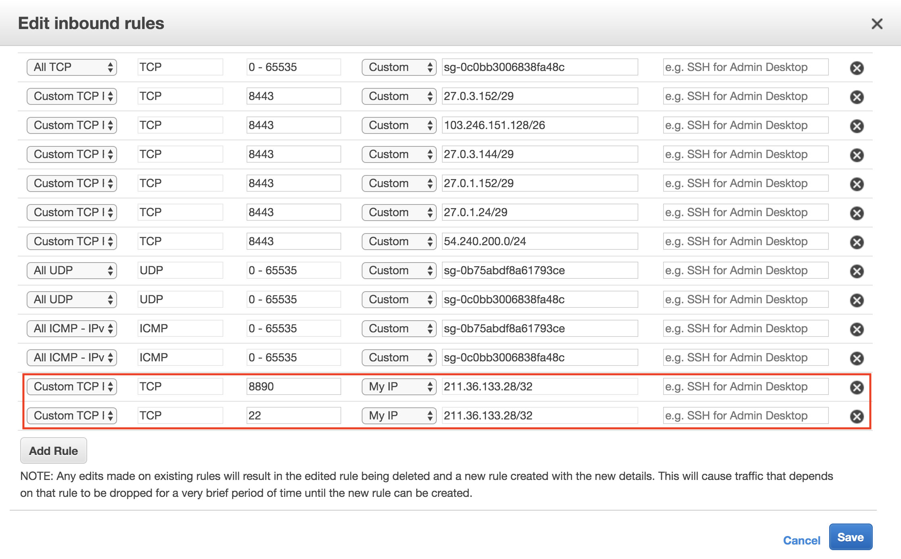

- 여기까지 모두 성공하셨다면 정상적으로 Spark 마스터노드 안에 구성된Zeppelin에 접근이 가능합니다.

```
접속URL: http://[생성된 마스터 퍼블릭 DNS]:8890
ex) http://ec2-**-***-***-**.ap-northeast-1.compute.amazonaws.com:8890
```
### 1-3. Zeppelin 세팅하기

- 데이터를 Zeppelin을 통해 만지기 전에 간단한 설정들을 해두겠습니다. 
  
- MasterNode에 접속하면 다음 명령어로 핸즈온에 사용할 쉘스크립트 파일을 다운로드합니다.

```
  wget https://raw.githubusercontent.com/boomkim/handong-AWS-camp/master/env_emr_spark_zeppelin.sh
```
 
  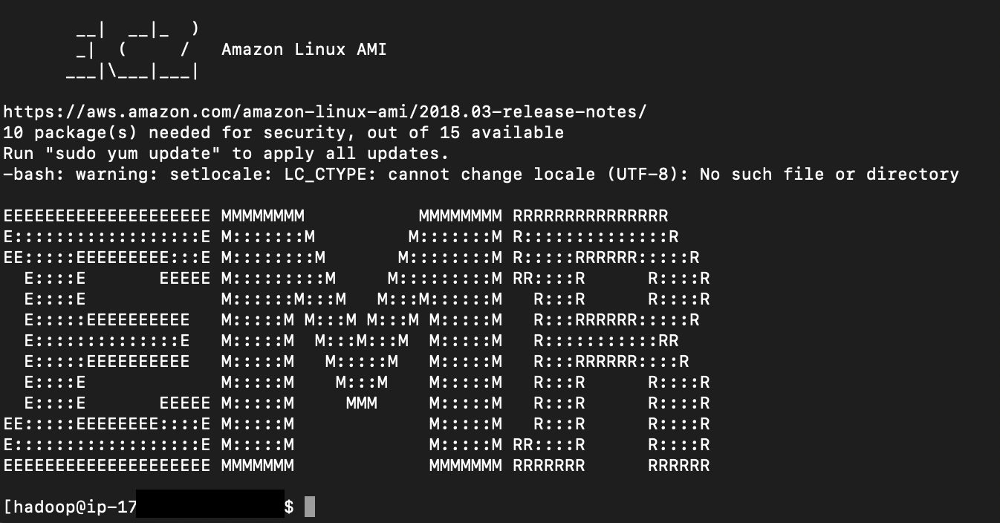
  
  - 쉘스크립트 실행합니다. Zeppelin ID는 ds_handson_20190509로 미리 설정했습니다. 쉘스크립트가 실행되면 Zeppelin 비번을 한번 입력해주셔야 합니다.

    ```
    sh env_emr_spark_zeppelin.sh
    ```
  
  - 설정 완료까지 수분이 소요됩니다.
  
- Zeppelin에 접속하여 `id: handong2019` `pw: {입력하신 패스워드}`로 접속이 정상적으로 되는지 확인합니다.
  
  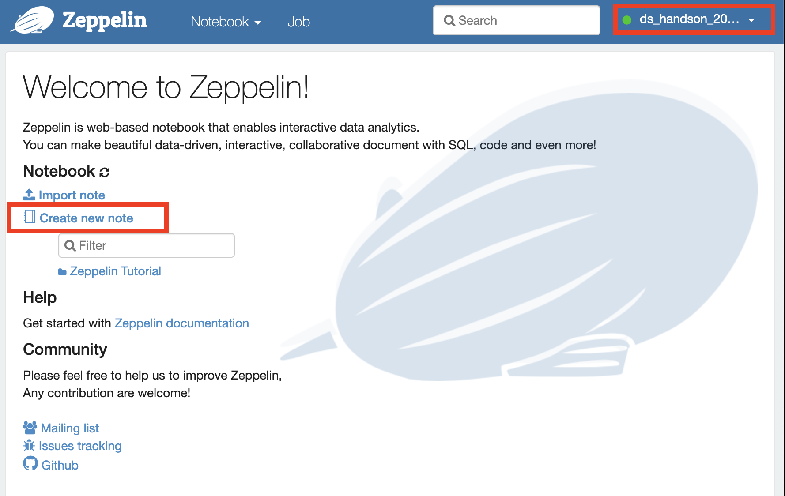

## 2. 데이터셋 준비하기
핸즈온에 사용할 데이터는 [SKT Big Data Hub](https://www.bigdatahub.co.kr)에서 제공하는 배달업종 이용현황 분석 2018년 데이터입니다. 사이트에 가보시면 회원가입 후 직접 다운로드가 가능. 하며 공개된 다양한 종류의 데이터가 많으니 확인해보시기 바랍니다.

~~7월 9일 까지 회원가입이 안되는걸로 공지되어있네요~~

### 2-1. 데이터 다운로드

[데이터 다운로드](https://bhkim2019.s3.ap-northeast-2.amazonaws.com/data.zip)
위 링크에서 다운로드 후 압축을 해제하시면 csv파일이 나오는데, 해당 파일을 아래 경로에 업로드 해주세요.

### 2-2. S3에 데이터 업로드

S3 콘솔로 이동해서 `[your_id]-handong2019`이라는 버켓을 생성하시고 original_data 폴더내에 업로드 해주세요.

- 업로드 위치: `s3://[your_id]-handong2019/original_data/`

## 3. Zeppelin을 이용하여 데이터 전처리

데이터분석을 위해 EMR 설정도 완료했고, 데이터도 준비되었습니다. 이제 진짜로 데이터를 들여다보도록 하겠습니다. 핸즈온으로 준비한 데이터는 총 80~90mb 정도되는 작은 데이터이고 충분히 Google Spread Sheet 서비스나 엑셀로도 처리가 가능합니다. 

이번 핸즈온에서는 실제로 빅데이터를 다루지는 않지만 어떻게 AWS 리소스를 이용하여 일반적인 워크스테이션이나 데이터베이스에서 처리할 수 없는 빅데이터를 분석할 수 있는지에 대한 접근방법을 익히는것이 중요한것임을 말씀드립니다. 

### 3-1. Zeppelin 시작하기
Zeppelin에 접속하여 노트북을 생성합니다.

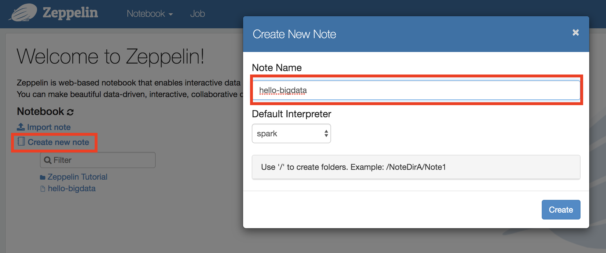

### 3-2. 데이터 불러오기 & 살펴보기
여기부터 진행되는 내용은 아래 코드블락을 Zeppelin 노트북에 복사&붙여넣기 해보시고 실행해보시면 됩니다.

- 자주쓰는 라이브러리 선언

  ```
  %pyspark

  from pyspark.sql.functions import *
  from pyspark.sql.types import *
  from datetime import datetime
  from dateutil.relativedelta import relativedelta
  import time

  ```

- S3 데이터 불러오기 (PySpark 이용)

  ```
  %pyspark

  dat = spark.read.csv("s3://[your_id]-handong2019/original_data/*", header = True)
  z.show(dat)
  ```
  
  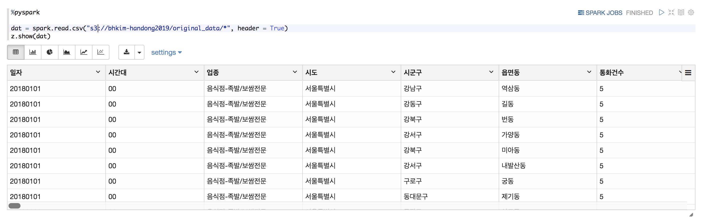
  
  요일별 분석을 위해 요일 정보가 있으면 좋겠습니다. [이 페이지](https://stackoverflow.com/questions/38928919/how-to-get-the-weekday-from-day-of-month-using-pyspark)를 참고하면 날짜에서 요일정보를 만들 수 있을 것 같습니다. 새로운 블록을 만들어서 아래와 같이 시도해봅니다.
  
  ```
  %pyspark
  
  dat = spark.read.csv("s3n://[your_id]-handong2019/original_data/*", header = True)\
    .withColumn("dow_number", date_format('일자', 'u'))

  z.show(dat)
  ```
  
  새로 만든 "dayofweek" 열에 예상했던 요일정보가 없고 null 값으로 채워져 있습니다. 사용한 [date_format 관련 문서](https://spark.apache.org/docs/2.1.0/api/python/pyspark.sql.html)를 보면 입력값으로 date와 format을 받습니다. 저희가 넘겨준 '일자'칼럼을 date로 인식하지 못해서 발생한 문제인 것 같습니다.

  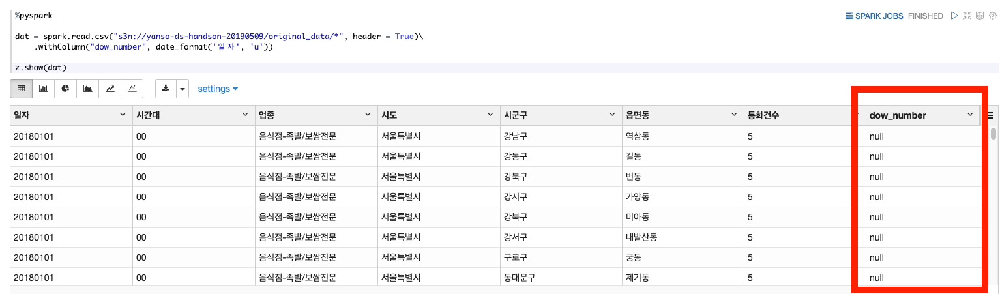

### 3-3. 데이터 전처리

- '일자' 컬럼을 PySpark가 좋아하는 형태로 변환시킵니다. to_date 함수의 foramt 파라미터에 date 정보의 형태를 알려주면 date 형태로 정보를 올바르게 읽어옵니다.
- 그 후에 다시 date_format 함수를 이용하여 요일정보를 가져옵니다.

  ```
  %pyspark
  
  dat = spark.read.csv("s3n://[your_id]-handong2019/original_data/*", header = True)\
    .withColumn("일자", to_date("일자", "yyyyMMdd"))\
    .withColumn("dow_number", date_format('일자', 'u'))\
    .withColumn("dow_string", date_format('일자', 'E'))
    
  z.show(dat)
  ```

  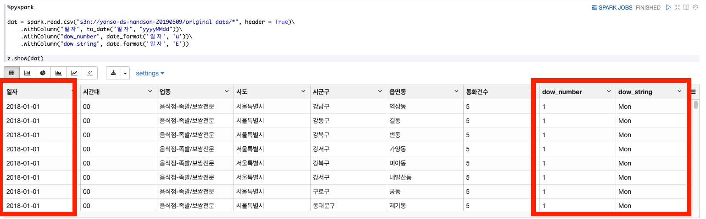

- 이와같이 Zeppelin을 통해 데이터 전처리가 가능하고 간단한 분석 및 시각화도 
가능합니다.

  ```
  %pyspark

  result = dat\
    .groupBy("dow_number", "dow_string")\
    .agg(sum("통화건수").alias("통화건수"))\
    .sort("dow_number")
    
  z.show(result)
  ```
  
  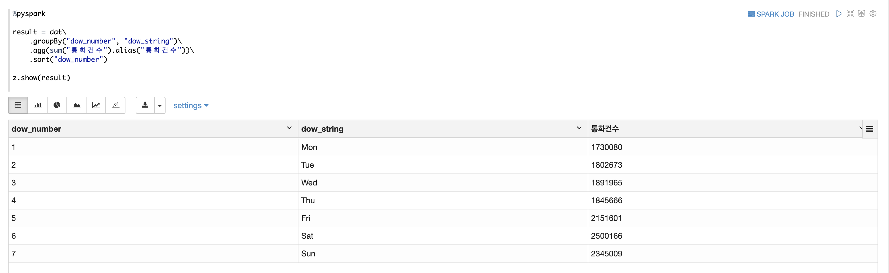
  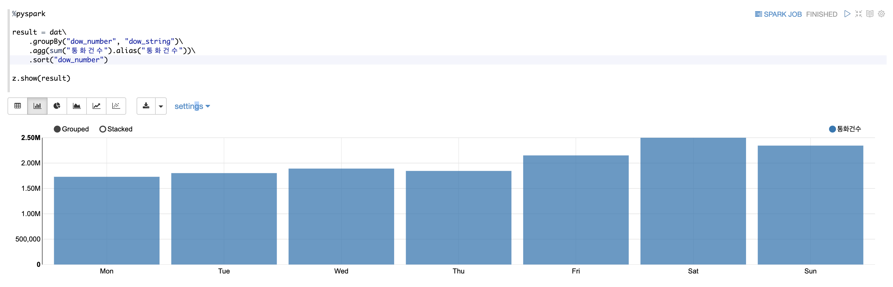

### 3-4. 전처리 데이터 저장하기

날짜포맷을 바꾸고 요일정보를 추가한 데이터를 다시 S3에 적재합니다. 기존에는 *[your_id]-handong2019* 버켓의 origianl_data 폴더에 1년치 데이터가  저장되어 있었습니다. 크게 문제가 되지 않을 파일 사이즈이지만, 만약 일별/월별로 적재되는 데이터의 사이즈가 크고 오랜기간 동안 데이터가 누적되었다면 그 데이터를 조회하는데만 큰 비용이 발생합니다.

- 효율적인 데이터 관리와 파티션이라는 개념을 향후에 사용하기 위해 폴더트리를 월단위로 변경하여 저장하겠습니다.

  ```
  %pyspark

  start_date = "2018-01-01"

  for mm in range(0, 12):
    dt = datetime.strptime(start_date, '%Y-%m-%d') + relativedelta(months = mm)
    date_yyyy_mm = "{:%Y-%m}".format(dt)
    date_simple = "{:%Y-%m-%d}".format(dt)
    print(date_yyyy_mm)

    result = dat\
        .filter(col("일자").startswith(date_yyyy_mm))\
        .repartition(1)\
        .write\
        .csv("s3://[your_id]-handong2019/result/{}".format(date_yyyy_mm), header=True, mode="overwrite")
  ```

해당 버켓의 result 폴더에 가보면 의도한대로 데이터가 월별로 폴더링 되어 적재되어 있습니다.

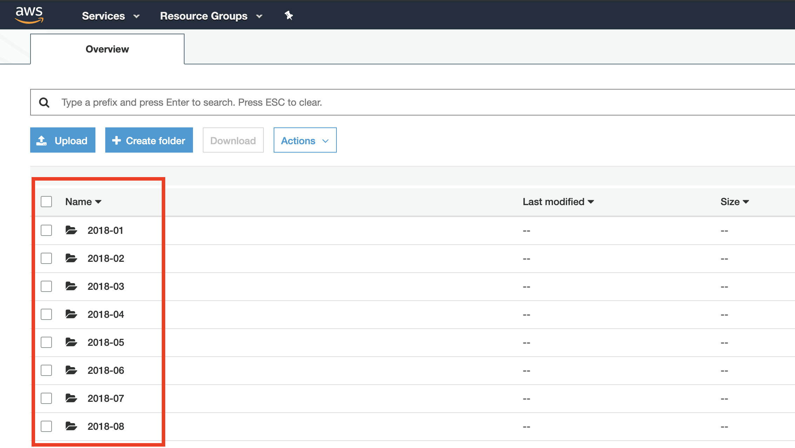

## 4. AWS Glue를 이용하여 데이터 카탈로그 생성

이전 단계에서 했던 데이터 처리작업은 S3에 적재되어있는 데이터를 제가 원하는 형태로 가공해서 S3 다른위치에 다시 적재하는 과정이었습니다. S3는 사용성이나 비용측면에서 여러가지 장점을 가지고 있어서 실제로 업무를 하면서도 필요에 따라 많은 종류의 그리고 대용량의 처리를 S3에서 무리 없이 사용하고 있습니다. 작업이 진행될수록 데이터들이 S3내에서도 산재되어 있고, 또한 모든데이터들이 S3에 있는것이 아니라 RDS, DynamoDB 등등 여러 소스에 존재해서 통합 관리의 필요성이 생깁니다.

이를 위해 AWS Glue 서비스의 가장 강력한 기능인 크롤러를 통해 자동으로 데이터 카탈로그를 생성하는것을 만들어 보겠습니다.

[AWS Glue](https://ap-northeast-1.console.aws.amazon.com/glue) 콘솔화면으로 이동합니다.

### 4-1. 데이터베이스 만들기

- 데이터베이스를 생성합니다. 이름은 `handong2019`로 입력합니다.

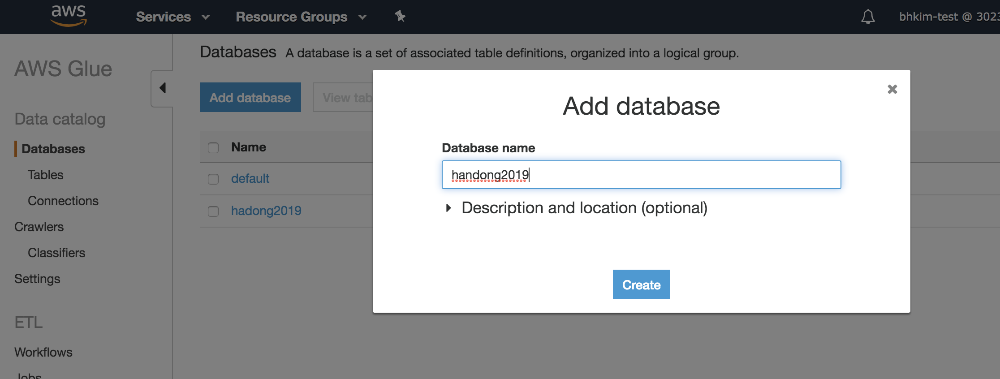

만들어진 데이터베이스 하위메뉴에 `Tables` 클릭해보면 아무런 테이블이 정의되어 있지 않다고 나옵니다. `Create Table` 메뉴로 수동으로 테이블을 입력할 수 있지만, 우리는 크롤러를 이용하여 자동으로 테이블을 생성하도록 하겠습니다. 왼쪽에 `Crawlers` 메뉴로 이동합니다.

- `Add Crawlers` 버튼을 눌러 크롤러를 생성합니다.

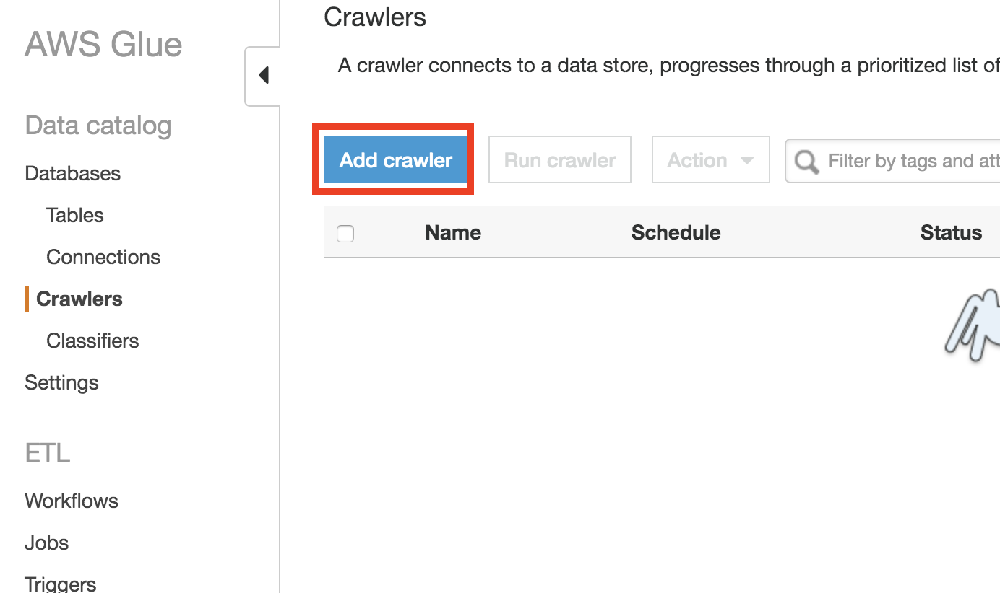

- 크롤러 이름을 입력합니다. `crawler-handong2019`로 입력합니다.

- 크롤링을 진행할 데이터소스를 지정합니다. 데이터 전처리 한 데이터를 S3에 적재해두었기 때문에 S3의 데이터를 데이터 소스로 사용하겠습니다. S3 경로를 입력 해 줍니다.
경로는 `s3://[your_id]-handong2019/result` 입니다.

- `Add another source` 에서는 `No` 를 선택해줍니다. 크롤링할 source가 s3버킷 하나뿐이기 때문입니다. 

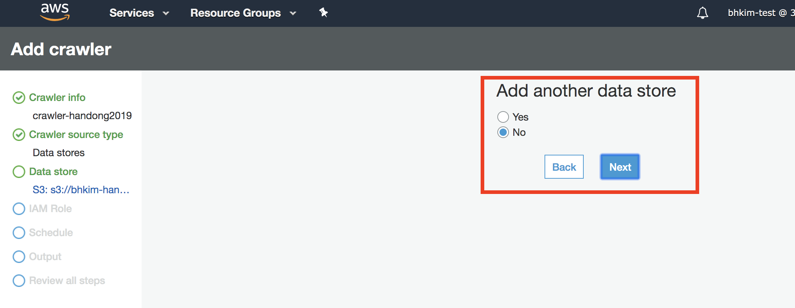

- 크롤러의 IAM 역할을 지정해줍니다. 역할을 직접 생성하셔서 필요한만큼의 권한을 부여하셔도 됩니다. 핸즈온을 위해서는 `Create an IAM Role`을 선택하고 Role이름을 입력합니다.

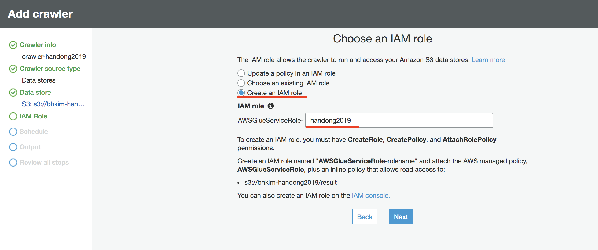

- 지금까지는 주기적으로 실행이 필요하지 않기 때문에 `On demand` 형태로 크롤러를 실행하겠습니다.

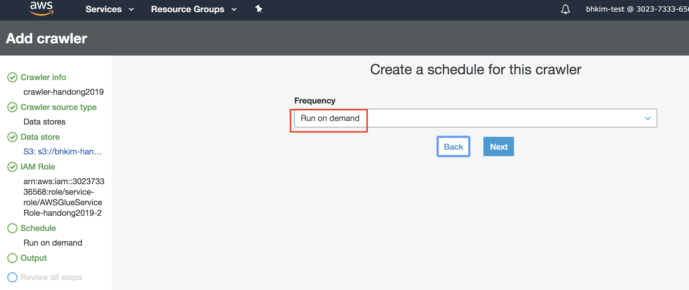

- 크롤링 결과는 테이블 형태로 출력을 하는데 해당 정보를 입력해줍니다. *handong2019* 데이터베이스를 선택합니다. 테이블이 생성될 때 접두사를 붙일수도 있습니다.

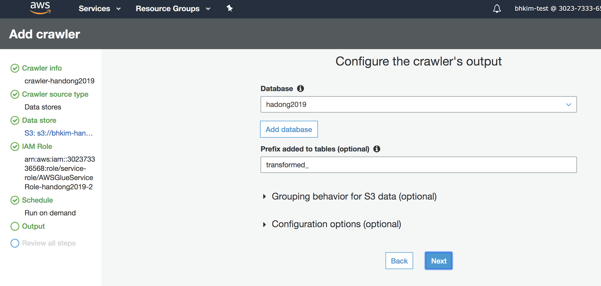

- 최종 정보를 확인하고 크롤러를 생성합니다.

- 생성 된 크롤러를 실행합니다. 크롤러가 실행되면 완료까지 수분이 걸립니다.

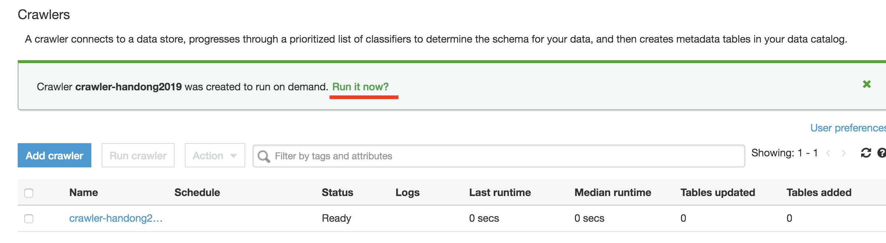

### 4-2. 생성된 테이블 살펴보기

크롤러 작업이 완료되면 `Tables` 메뉴에서 생성된 테이블을 확인 가능합니다.

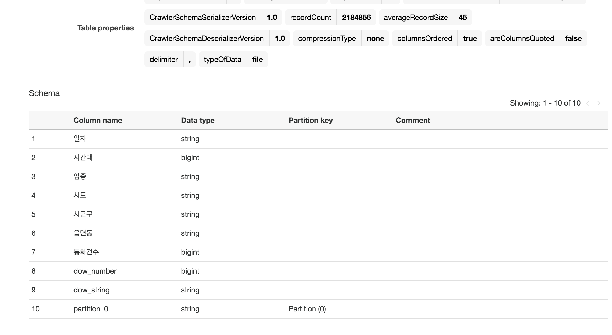

글루가 S3를 여기저기 돌아 데이터의 스키마를 파악하고 위와 같이 테이블을 만들었네요. 그런데, Column name이 한글인게 조금 거슬립니다. Athena에서는 column 명에 한글을 지원하지 않거든요. 바꿔줍시다

테이블 상세보기 상단에 `Edit Schema`를 클릭해줍니다. 

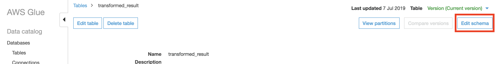

한글로 된 컬럼을 클릭해주고 영어로 수정하고 저장을 눌러줍니다.

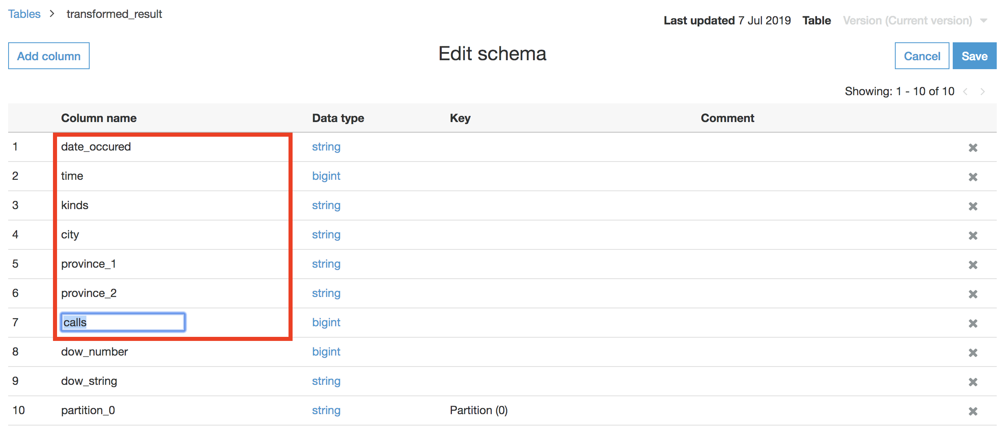

이제 데이터 스키마가 깔끔해진것 같습니다. 

### 4-3. Amazon Athena에서 카탈로그를 통해 데이터 불러오기

이렇게 생성된 데이터 카탈로그를 통해서 AWS 내부/외부 서비스에서 데이터를 쉽게 접근할 수 있게 됩니다. 서비리스 쿼리 서비스인 Amazon Athena를 통해서 S3에 있는 데이터를 카탈로그를 통해 조회해보도록 하겠습니다.

`Tables`에 `View Data` 메뉴를 통해 Amazon Athena 서비스로 이동합니다.

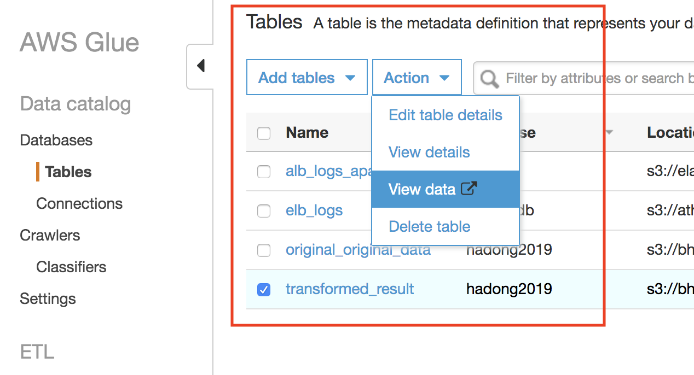

해당 데이터베이스와 테이블을 선택하면 SQL 쿼리로 데이터 조회가 가능합니다.

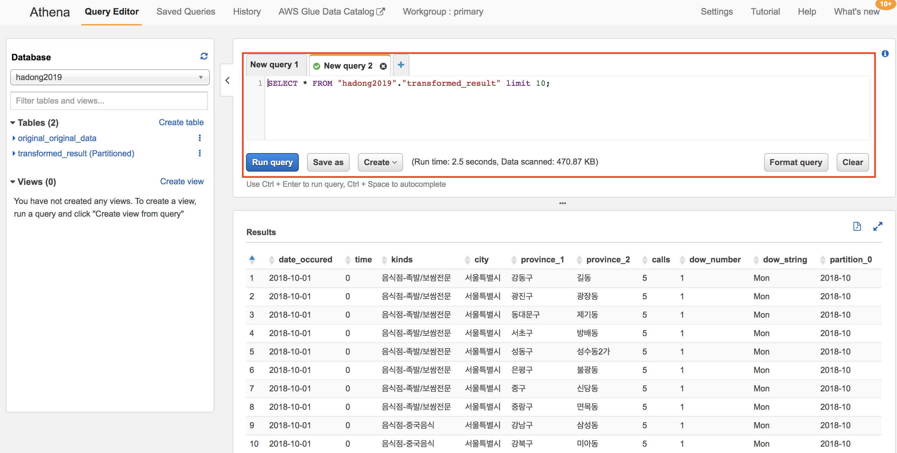

### 4.4 쿼리 예시

SQL문으로도 충분히 이것저것 데이터를 뒤져볼 수 있습니다. 

```SQL
--- 종목별 숫자들 
SELECT kinds, sum(calls) as calls FROM "hadong2019"."transformed_result" 
GROUP BY kinds
ORDER BY calls DESC;

--- 월별 통계 
SELECT partition_0 as months, sum(calls) as calls FROM "hadong2019"."transformed_result" 
GROUP BY partition_0
ORDER BY months;

-- 12월 통계, WHERE 조건에 Partition이 들어가면서 Athena가 스캔하는 데이터가 줄어드는 것에 주목해주세요. 스캔하는 데이터의 양이 곧 돈이니까요. 
SELECT kinds, sum(calls) as calls FROM "hadong2019"."transformed_result" 
WHERE partition_0 ='2018-12'
GROUP BY kinds
ORDER BY calls;

-- 12월 구별 통계: 강남/ 강서구에서 많이 시켜먹네요. 
SELECT province_1, sum(calls) as calls FROM "hadong2019"."transformed_result" 
WHERE partition_0 ='2018-12'
GROUP BY province_1
ORDER BY calls DESC;

-- 12월 구/동별 통계: 신대방동에는 무슨일이 있는걸까요
SELECT province_1, province_2, sum(calls) as calls FROM "hadong2019"."transformed_result" 
WHERE partition_0 ='2018-12'
GROUP BY province_1, province_2
ORDER BY calls DESC;

```

## 5. Quicksight로 시각화하기 

그럼 이제 예쁘게 그림을 그려봅시다. 

Quicksight는 AWS에서 제공하는 BI 툴입니다. 다른 상용 BI툴에 비해서는 부족하지만 그래도 저렴한 가격과 다른 AWS 서비스 와의 연동이 편하다는 장점이 있습니다. 

### 5-1. Quicksight 계정 생성 

- Quicksight 콘솔로 이동 
- Quicksight 구독

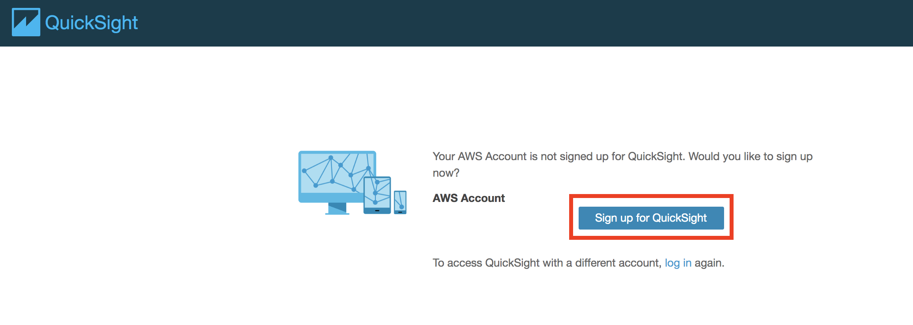

- Standard plan 선택 
- Tokyo Region 선택 
- `Quicksight accountname` : `{username}-handong2019`
- `Email` 입력
- `Choose s3 buckets`: `Select all`
- 나머지는 그대로 둡니다. 
- `Finish` 클릭
- `Go to Amazon Quicksight` 클릭 

아래와 같은 화면에 진입하면 성공입니다. 이상하게 도쿄리전으로 시작하면 모바일뷰로 나오네요. (버그인듯)

### 5.2 Data set 만들기 

이제 Quicksight에 Data set을 정의해줍니다. 

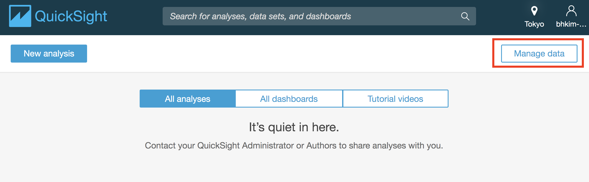

- `Manage Data` 클릭 
- `New data set` 클릭
- `Athena` 클릭 

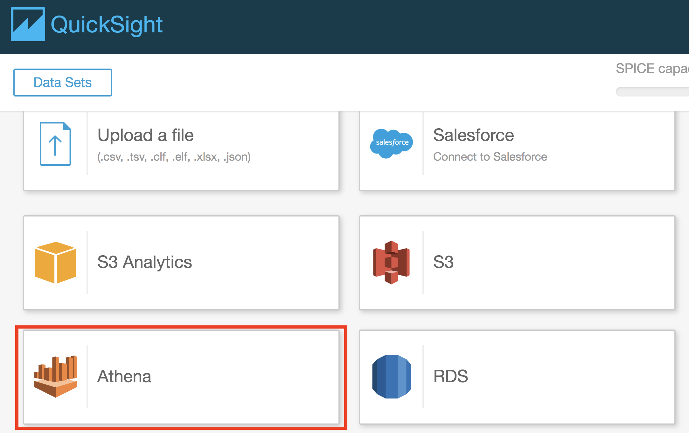

- `Data Source Name`에 `delivery-2018` 입력 후 `Create data source` 클릭 

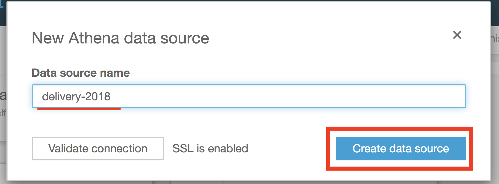

-`handong2019`, `transformed_result` 선택 후  `select` 선택 

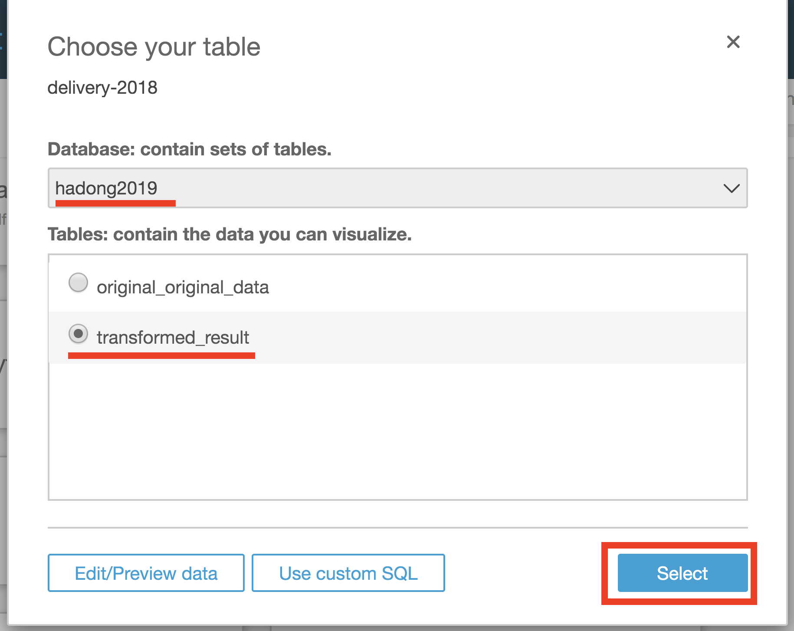

- `Import to SPICE for quicker analytics`를 선택합니다. (1gb 까지는 무료라니깐 한번 사용해봅시다.)

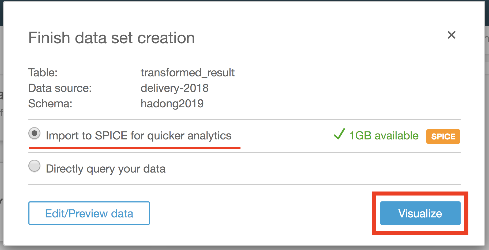

### 5.3 Visual 만들기 

- visualize 창에서 이것저것 만져 봅시다. 

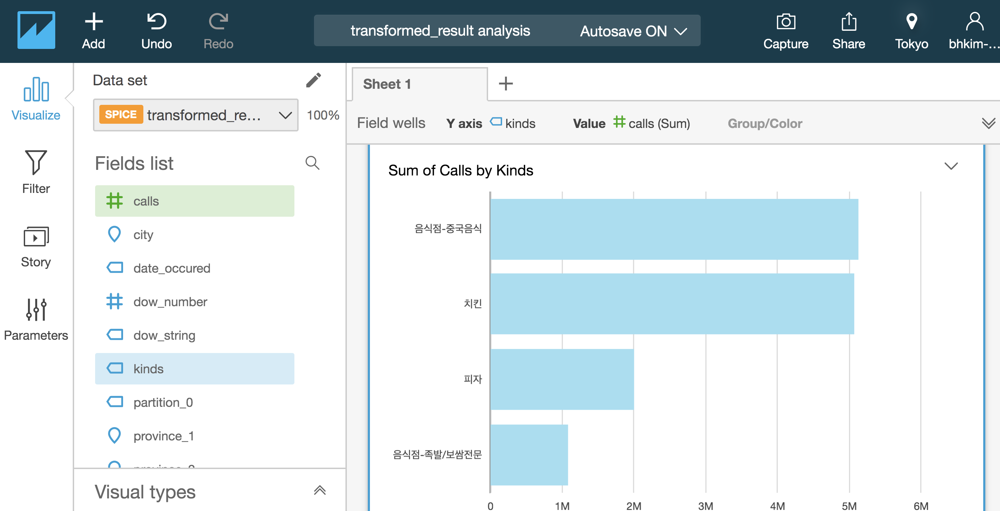

시각화의 단계는 사실 Data Scientist 들의 영역이기도 하고 데이터에 대한 insight가 필요한 영역이기도 합니다. 기본적인 통계, 집계등을 이용하여 Insight가 있는 시각화를 만드려면 데이터를 이것저것 뒤져봐야 하고 어떤 결과물이 필요한지에 대한 깊은 고민이 필요합니다. 

Field list를 이것저것 조합하고, 값을 조정해보면서 어떤 그래프를 그릴 수 있는지 살펴 봅시다. 

그렇게 이것저것 만져보다가, 그리고 싶은 그림이 있는데 필요한 자료가 없을 경우에는 어떻게 할지 생각해봐야 합니다. 어떻게 자료를 더 얻어올 수 있는지, 어떻게하면 데이터를 더 가치있게 만들 수 있는지. 필요하다면 다시 ETL작업을 하거나, 새로운 데이터를 수집하는 등의 작업을 해야합니다. 

*하지만* 오늘 우리의 목표는 어쨌든 **데이터를 수집**하고, **저장**하면서 **변환**하고, **분석**하고, **시각**화하는 과정을 전체적으로 경험해보는 것입니다. 여기까지 모두 따라왔다면 소기의 목적은 달성했다고 생각합니다. 

## 6. 리소스 삭제

리소스 삭제는 하신 작업의 역순으로 하시면 됩니다.

  - quicksight 구독 해제 
    - 오른쪽 위 사람 이미지 -> `Manage QuickSight`
    - `Account settings` -> `Unsubscribe`
  - Glue 테이블, 크롤러 삭제
    - glue 콘솔 접속 
    - `Tables` -> 테이블 선택후 `Actions` -> `Delete Table`
  - S3 데이터 삭제 
    - s3 콘솔 접속 
    - `{username}-handong2019`버킷 삭제 
    - `aws-athena-query-results-{계정번호}-ap-northeast-1` 버킷 내용 삭제 
  - EMR 클러스터 삭제
    - EMR 콘솔이동 
    - 해당 클러스터 선택 후 `Terminate`
  

## 참고자료
AWS 기반 지속 가능한 데이터 분석 플랫폼 구축하기
: https://github.com/awskrug/datascience-group/tree/master/workshop-sustainable_data_analysis

위 자료에서 기본 데이터와 전체 핸즈온의 흐름 등은 거의 그대로 사용했습니다. 다만 위의 자료에선 시각화를 위해 Presto, Tableau 를 사용합니다.

추가적으로 Athena와 Zeppelin의 연동이 궁금하다면 [여기](https://github.com/boomkim/handong-AWS-camp/blob/master/Zepplin-Athena.md) 에 자료를 올려놨습니다. 

Day3 Bigdata 까지 고생이 많았습니다. 

마지막 AI/ML을 향해 조금만 더 힘을 내 봅시다 화이팅! 
