# 한동대 AWS Camp Day-3-2 AI/ML 실습

## 0. Overview

### Sagemaker?

Amazon SageMaker 는 데이터 사이언티스트와 개발자들이 쉽고 빠르게 구성, 학습하고 어떤 규모 로든 기계 학습된 모델을 배포할 수 있도록 해주는 관리형 서비스 입니다. 이 워크샵을 통해 Sagemaker notebook instance 를 생성하고 샘플 Jupyter notebook 을 실습하면서 SageMaker 의 일부 기능을 알아보도록 합니다.

## 1. S3 버킷 생성

* AWS 콘솔 Sign in -> S3 콘솔 접속 
* AWS S3 버킷 생성 `sagemaker-{userid}`

## 2. Notebook instance 생성 

* Sagemaker 콘솔 접속 
* 좌측 `Notebook Instance` -> `Create notebook instance` 클릭 
* instance 이름: `{username}-workshop` 
* 인스턴스 타입: `ml.m4.xlarge`
* IAM Role: `Create a new role` 
* (팝업창에서) Specific S3 Buckets: `sagemaker-{userid}` (위에서 생성한 버킷) 입력 후 `Create role`
* (나머지는 모두 그대로)
* 다시 Create Notebook instance 페이지로 돌아온 뒤 `Create notebook instance` 를 클릭합니다.

## 3. Notebook Instance 접근 

* 서버 상태가 `InService` 로 바뀔 때까지 기다립니다. 보통 5 분정도의 시간이 소요 됩니다.
* `InService` 가 된 후 `Open Jupyter`을 클릭하면 Notebook으로 접속할 수 있습니다. 

## 4. 실습용 코드 다운로드 

* 터미널 실행 (우측에 `New` -> `Terminal`)
* 터미널에서 깃 클론 
```bash
cd SageMaker/
git clone https://github.com/boomkim/handong-AWS-camp.git
```
* Jupyter notebook refresh 
* handong-AWS-camp/notebooks 에 노트북을 확인할 수 있습니다. 

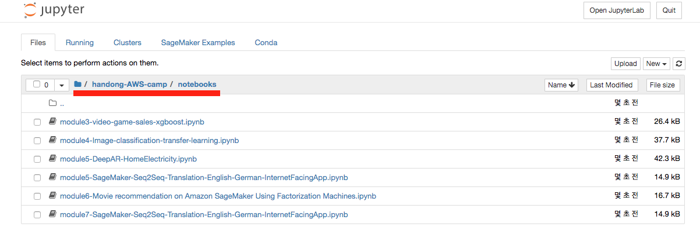

## 5. XGBoost 체험

`module3-video-game-sales-xgboost.ipynb` 을 클릭해서 XGBoost를 한번 체험해 봅시다.  

## 6. Internet-facing 앱 개발 

3일간의 코스 중 마지막을 장식할 세션입니다

이 모듈에서는 영어를 독일어로 변환하는 SageMaker 의 Sequence-to-Sequence 알고리즘을 이용한 언어번역기를 학습해보고 이 서비스를 인터넷을 통해 활용할 수 있는 방법에 대해 실습해 보겠습니다.

본 Hands-on 에서는 SageMaker 에서 생성한 Endpoint inference service 를 웹 상에서 호출하기 위해 AWS Lambda 와 AWS API Gateway 를 Figure 4 과 같은 데모를 만들어 보겠습니다.

**예상시간: 약 1시간 ~ 1시간 30분**

## 6.1 영어-독어 번역 ML 모델 생성

### 노트북 소개 

* 노트북 오픈: `module7-SageMaker-Seq2Seq-Translation-English-German-InternetFacingApp`
* 원본: `/sample-notebooks/introduction_to_amazon_algorithms/seq2seq_translation_en-de/SageMaker- Seq2Seq-Translation-English-German.ipynb`

이번에 실행할 노트북은 원본의 노트북의 내용을 조금 수정한 버전입니다. 원본 노트북에서는 전체 데이터 중 10000개의 샘플 문장만 가지고 학습을 진행합니다. 

실제로는 10000 개의 샘플 문장으로 훈련한 번역기는 좋은 결과를 보여줄 수 없습니다. 그렇지만 전체 데이터 학습을 위해서는 선택하시는 SageMaker 의 서버 Instance Type 에 따라 다르지만 수시간에서 수일의 장시간이 소요될 수 있습니다. 

따라서 이번에는 "Pre-trained"된 모델을 사용합니다. 

이 Pre-trained model 을 사용하기 위해서는 노트북의 코드 중 S3 Bucket 명만 수정해서 이미 훈련된 모델을 다운로드 한 다음 본인의 S3 버켓으로 업로드 하시면 됩니다. **이때 Jupyter 노트북 마지막 줄의 sage.delete_endpoint 는 데모를 계속 진행하기 위해 실행하지 않습니다.** 이를 위해 이번에는 가장 마지막 줄에 있는 코드를 주석 처리하겠습니다.

### 노트북 실행 방법

`Shift+Enter`: 셀안의 코드를 실행하고 다음 셀로 이동 

*전체를 실행할 시 12분에서 15분 정도 소요됩니다.*

*노트북 코드 중 “Create endpoint configuration” 셀에서 현재 InstanceType 이 ‘ml.m4.large’ 로 되어 있습니다 (Figure 13 참조). Seq2Seq 알고리즘은 Neural network 기반이기 때문에 ml.p2.xlarge (GPU) instance 를 사용하실 수 있지만 본 실습에서는 Free tier 가 지원되는 ml.m4.xlarge 를 사용하고 있습니다. ml.t2.* instance 는 time-out 문제가 발생할 수 있으므로 본 실습에서는 사용하지 않습니다.*

*노트북 코드 중 “Create endpoint” 셀은 새로운 서버를 설치하고 실행 코드를 설치하는 과정이므로 본 노트북에서는 가장 많은 시간 (약 10~11 여분)이 소요 되는데 아래와 같은 메세지를 확인하시면 다음 모듈로 진행하시면 됩니다 (Figure 14 참조).*

**노트북 가장 하단의 delete_endpoint는 실행시키지 마세요**

## 6-2 Samemaker Endpoint 호출 Lambda 함수 개발 

본 모듈에서는 방금 생성한 SageMaker 의 Inference service 를 호출하는 Lambda 함수를 개발해 보겠습니다.

### Lambda 함수 생성하기 

* lambda 콘솔로 이동 
* `Create function` 클릭 
* Lambda 
    * `Name`: `MySeq2SeqInference` 
    * `Runtime`: `Python 3.6`
    * `Role`: `Create a new role with basic Lambda permissions` 선택
    * `Create Function` 클릭
    * 생성된 화면에서 role 확인 
    * `View the {생성된 Role}` on the IAM Console 클릭해서 IAM으로 이동 
     

### Lambda 함수에 Sagemaker 실행 권한(Role) 추가 

* `Add inline policy` 클릭 
* 검색창에서 `SageMaker` 입력 
* `Actions`-> `Access level` -> `Read` 에서 `DescribeEndpoint` 와 `InvokeEndpoint` 선택 
* 화면 하단의 `Resources` 에 `You chose actions that require the endpoint-config resource type` 선택 후 `Any` 를 클릭
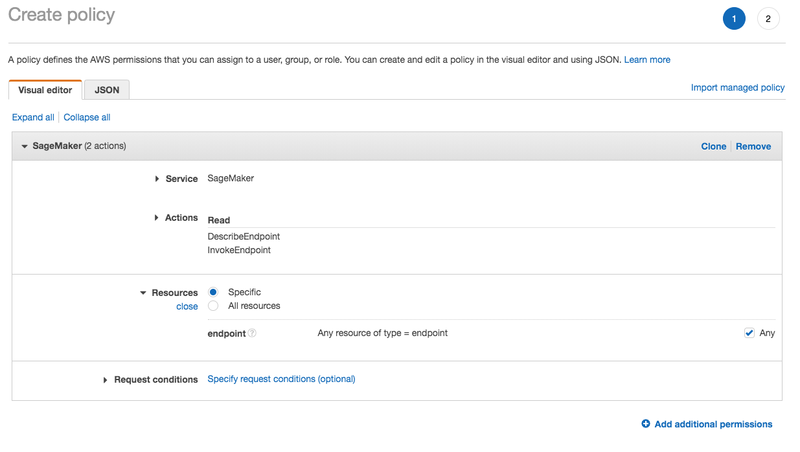
* `Review policy` 클릭 
* 새로운 Policy 이름 입력 (예: `sagemaker_endpoint_policy`)후 `Create Policy` 클릭 

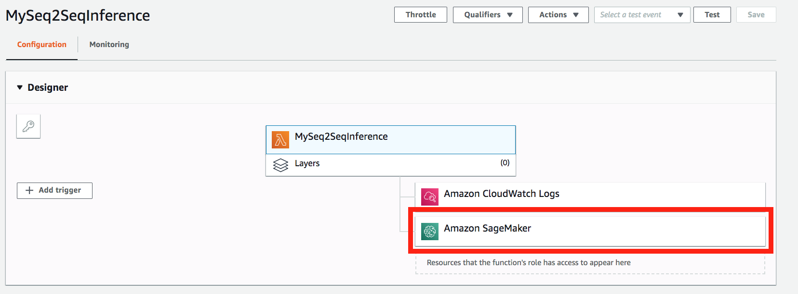 Sagemaker 권한이 추가되었습니다. 

## Lambda 함수 코딩하기 

* 람다의 콘솔로 돌아와서 아래 코드를 붙여넣습니다. `endpoint`는 자신이 만든 endpoint로 바꿔줍니다.(Sagemaker Endpoint)

```python
import boto3
import json
    
def lambda_handler(event, context):
    
    sagemaker = boto3.client('runtime.sagemaker')
    endpoint_name = 'ReplaceWithYourSeq2SeqEndpointName'
    
    sentences = event["sentences"]

    payload = {"instances" : []}
    for sent in sentences:
        payload["instances"].append({"data" : sent["query"]})
    
    response = sagemaker.invoke_endpoint(EndpointName=endpoint_name, 
                                       ContentType='application/json', 
                                       Body=json.dumps(payload))
    
    response = response["Body"].read().decode("utf-8")
    response = json.loads(response)
    
    return response
```


* Lambda의 Timeout 시간을 10초로 늘입니다.

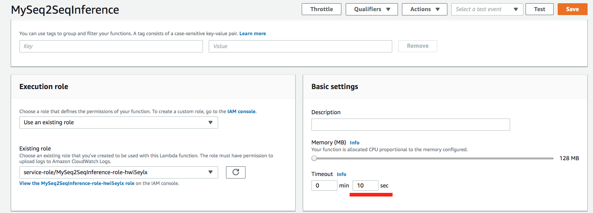

* 일단 여기서 `Save` 

### test event 생성 

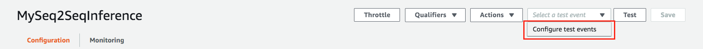

* configure test events 
* Event name 입력 (예:`SampleEnglishSentence`)
* 아래의 테스트 이벤트 입력 

```json
{
    "sentences": [
        {
            "query": "I love you"
        }, {
            "query": "I love you, too" }
    ] 
}
```
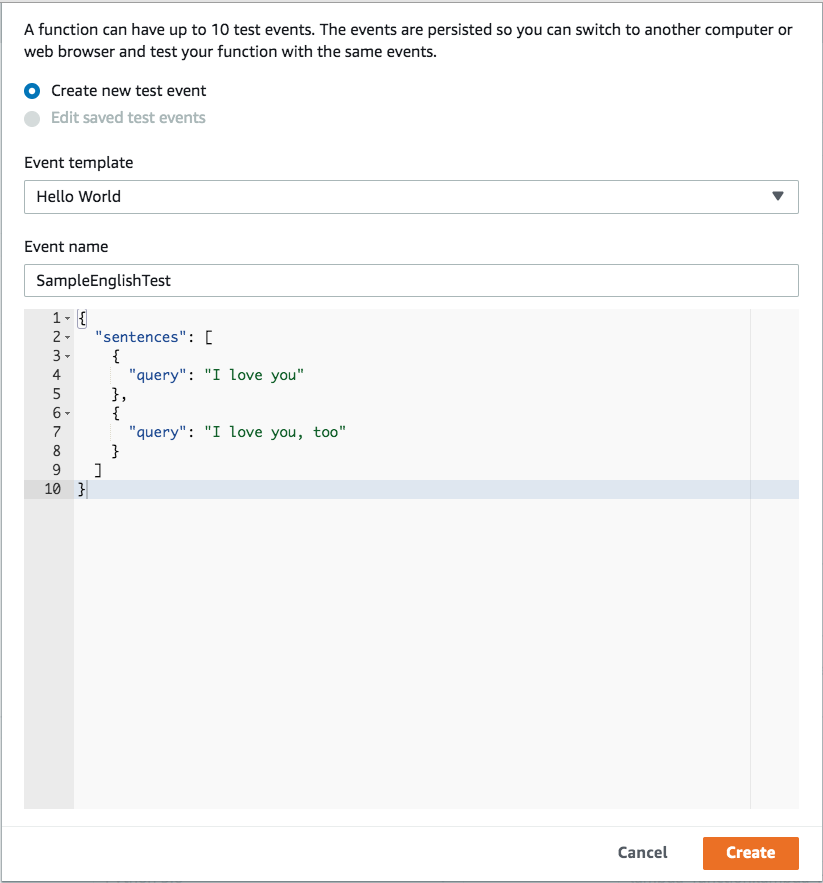
* `Create` 클릭 
* `Test` 클릭 후 결과 확인 

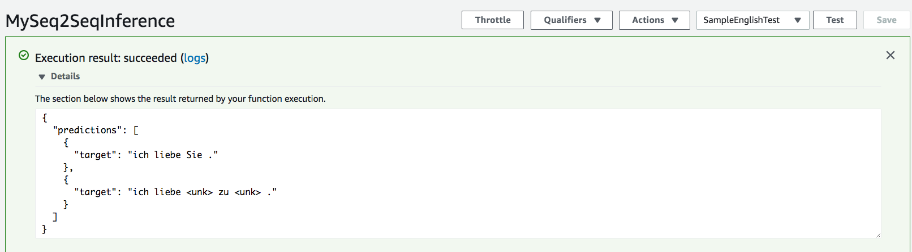

## 6-3 AWS API Gateway 와 S3 Static Web Server 를 이용한 웹서비스 연결하기

### API Gateway 생성 및 Lambda 함수 연결하기

*  Amazon API Gateway 콘솔 접속 
* `Create API` -> `New API` 선택 (혹은 `Get Started` 선택  -> `Create new API` 에서 `New API` 선택)
* `API NAME`: (예: `SageMakerSeq2SeqLambdaGateWay`)
* `Endpoint Type`: `Regional` 선택 후 `Create API`
* 바뀐 화면에서 `Actions` -> `Create Method` 선택
* 하단의 콤보 박스에서 `POST` 선택 후 체크(V) 버튼 클릭 
* 오른쪽의 셋업 창에서 다음과 같이 입력 
    * `Integration type`: `Lambda function`
    * `Lambda region` : Labmda 를 생성한 Region (ap-northeast-2) 입력 
    * `Lambda function`: Lambda 함수 이름 입력 (`MySeq2SeqInference`)
    * `Save` 선택
* Lambda Test
    * `Test` 클릭 
    * `Request Body` 의 아래 내용 입력 후 `Test` 클릭

```json
{
    "sentences": [
        {
            "query": "I love you"
        }, {
            "query": "I love you, too" }
    ] 
}
```

* Enable CORS 
    * `Actions` -> `Enable CORS`
    * `Enable CORS and Replace existing CORS headers` 선택 
    * `Yes, Replace existing values` 선택 
* `Actions` ->  `Deploy API`
* `Stage name`: `Prod` 입력 후 `Deploy`
* Inkoke URL 메모장에 기록 
* `SDK Generation` -> `Platform`: `JavaScript` -> `Generate SDK` 선택

### S3를 이용해 Static web server를 설정하기 위한 파일 준비

* API Gateway SDK 생성으로 다운받은 압축파일을 unzip 
* [여기](https://bhkim2019.s3.ap-northeast-2.amazonaws.com/index_error_html.zip)에서 파일 다운로드 후 압축 해제
* S3 Static 웹 서버에 사용될 index.html 과 error.html 파일 압축이 풀린 폴더에 저장

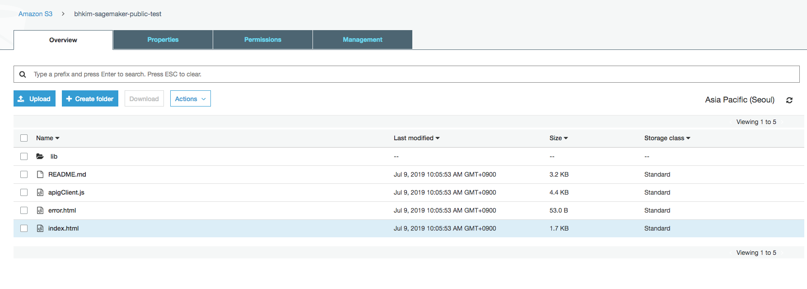
이렇게 4개의 파일 1개의 폴더가 있으면 됩니다. 

### S3 Static Web Server 생성하기 

* Amazon S3 콘솔 접속 
* `Create Bucket` 선택
* 새로운 버킷 이름 입력 (ex: `{username}-sagemaker-public-test`) -> `Next` -> `Next` 선택 
* `Set permissions` 에서 `Block all public access` 해제 
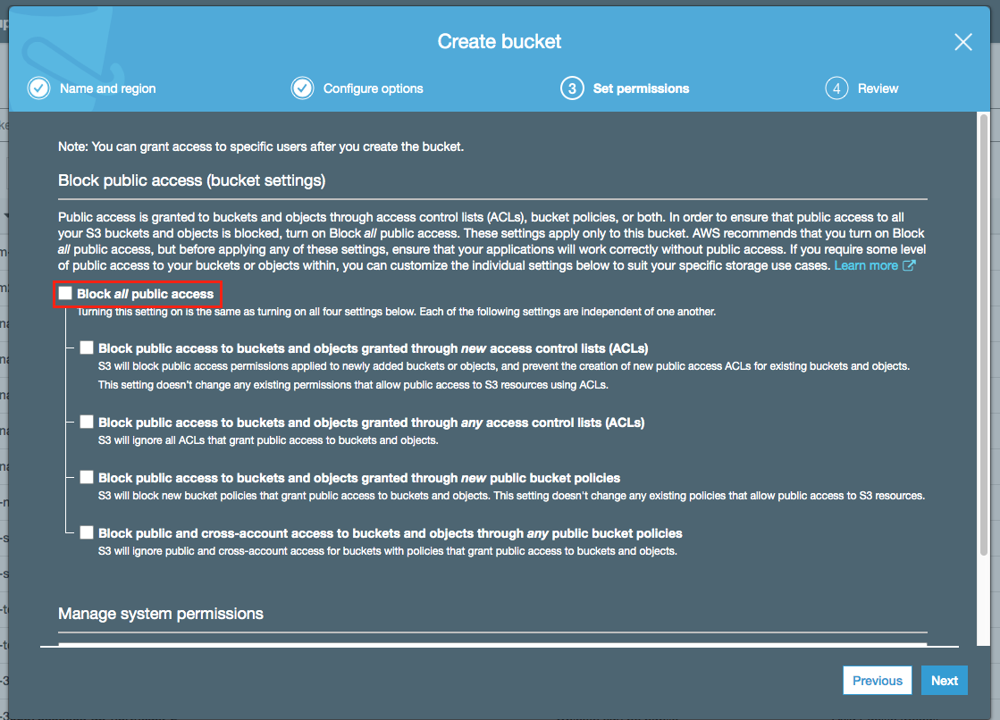
* `Next`-> `Create Bucket` 선택 
* 생성된 S3 bucket 선택 
* `Properties` -> `Static website hosting` -> `Use this bucket to host a website` 선택 후 `Index document`: `index.html`, `Error document`: `error.html` 입력 
* `Save` 선택 
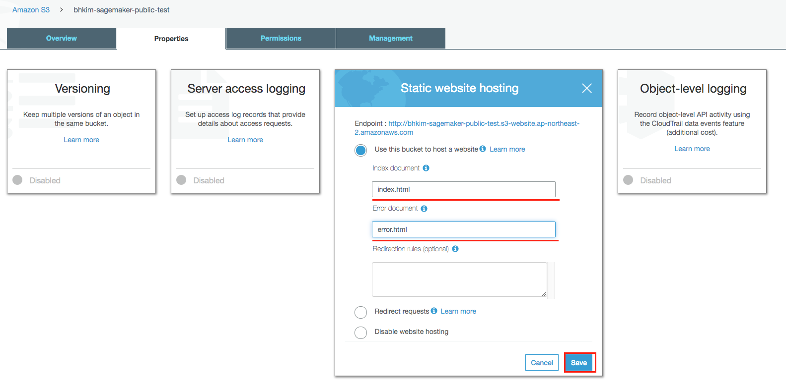
* 상단의 Endpoint 메모장에 기록 
* `Overview` 탭 선택 -> `Upload` 선택 
* 파일들 업로드, `Set permissions` 에서 `Grant public read access to this object(s)` 설정 


## 6-4 서비스 테스트하기 

* 웹브라우저(Chrome, IE, Safari 뭐든... )에서 기록해둔 S3 Endpoint URL에 접속. 
* Translate to German 오른편의 텍스트 입력창에 영문 문장을 입력 (Ex. "I love you")
* 잠시 뒤에 결과가 보여집니다.

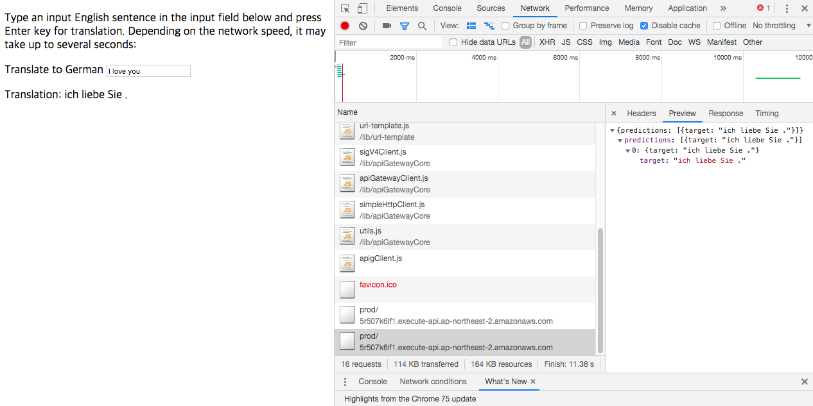

## 7. 정리 

~~분해는 결합의 역순~~

지금까지 구성한것을 역순으로 하나씩 삭제합니다. 

* S3 버킷 삭제 
    * `sagemaker-{username}`
    * `{username}-sagemaker-publict-test`
* API 삭제
    * `Actions` -> `Delete API`
* Lambda 함수 삭제 
* IAM Role 삭제 
* Sagemaker Endpoint 삭제 
* Sagemaker 모델 삭제 
    * pretrained model
    * XGboost Model 
* Sagemaker Notebook 종료 
    * `Stop` -> `Delete` 
